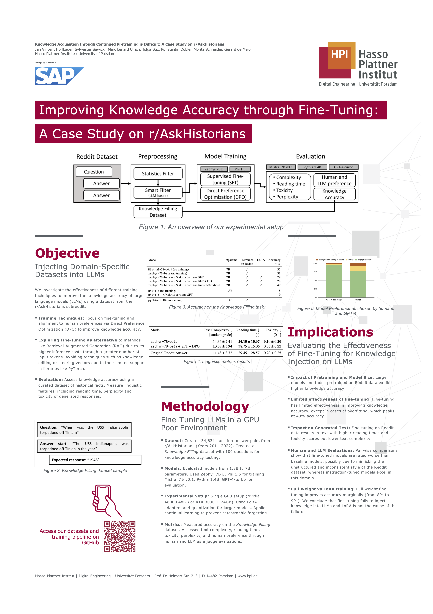

# askhistorians-knowledge-filling

Official repository for the paper "Knowledge Acquisition through Continued Pretraining is Difficult: A Case Study on r/AskHistorians"

<p align="center">
    
</p>

## Dataset

The `AskHistorians Knowledge Filling` dataset can be found on [Huggingface](https://huggingface.co/datasets/aiintelligentsystems/askhistorians-knowledge-filling)

## Training Commands

The training commands can be found in [training_commands](./training_commands/) and executed in a docker container. Example:

```sh
sh run_in_docker.sh training_commands/train_askhist_zephyr_sft_dpo_bf16.sh
```
